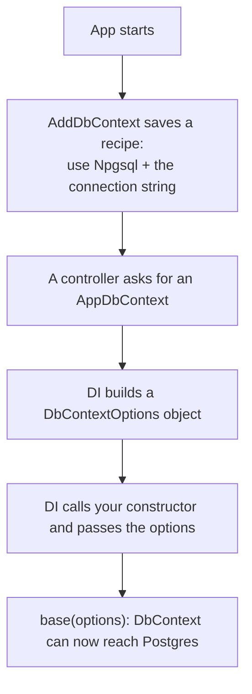

## What we did

We connected the SmartShop backend to a PostgreSQL database. The hard part is the connection string. It holds the database address and the password, so we had to keep it in a safe place and hand it to the app in a clean way.

We did three things:

1. Stored the connection string in User Secrets (a safe place outside the project).
2. Registered the database in `Program.cs` using `AddDbContext`.
3. Let dependency injection pass the connection settings into `AppDbContext`.

## The pieces

| Piece | Where it lives | What it does |
| --- | --- | --- |
| Connection string | User Secrets | Holds the address, username, and password for Postgres |
| `AddDbContext<AppDbContext>` | `Program.cs` | Tells the app to use Postgres with this connection string |
| Constructor `AppDbContext(DbContextOptions ...)` | `Configurations/AppConfig.cs` | Receives the settings and passes them to the base `DbContext` |
| `UserSecretsId` | `SmartShop.csproj` | Links your project to its secret file on disk |

## How it works, step by step

Here is what happens when the app runs.



In plain words:

1. When the app starts, `AddDbContext` does not build a database object yet. It saves a recipe: when someone needs an `AppDbContext`, make one with Postgres and this connection string.
2. Later, a controller or service asks for an `AppDbContext` in its own constructor.
3. Dependency injection reads the recipe, builds a `DbContextOptions` object (which holds "use Npgsql plus the connection string"), and passes it into your `AppDbContext` constructor.
4. Your constructor sends it to `base(options)`, so the parent `DbContext` now knows how to reach the database.

You never write `new AppDbContext()` yourself. The framework builds it for you and fills in the settings. That is what dependency injection means here: the thing you need (the database settings) is given to you, instead of you creating it yourself.

## Where the connection string is really stored (in depth)

This is the important part, so here is the full picture.

The connection string is not in your project folder. It is not in `appsettings.json`, and it is not in Git. It lives in a separate file in your Windows user profile:

```text
C:\Users\<you>\AppData\Roaming\Microsoft\UserSecrets\449ef79a-2e64-4de1-be60-7432436d20c1\secrets.json
```

That long number is the `UserSecretsId` from `SmartShop.csproj`. It is a random id that acts as the link between your project and that secret file. When the app runs in development, .NET reads the id, finds the matching folder, and loads `secrets.json`.

Inside that file, the value looks like this:

```json
{
  "ConnectionStrings:DefaultConnection": "Host=localhost;Port=5432;Database=SmartShop;Username=postgres;Password=your_password_here"
}
```

How the value is read at runtime:

1. .NET builds one combined settings object called Configuration.
2. It stacks several sources on top of each other, in this order:
   * `appsettings.json`
   * User Secrets (development only)
   * Environment variables
3. Later sources win. If the same key exists in two places, the one loaded last is used.
4. `builder.Configuration.GetConnectionString("DefaultConnection")` reads the `ConnectionStrings:DefaultConnection` key from that combined object.

So your code does not care where the value came from. It only asks for `DefaultConnection` and gets whatever the current environment provides.

## How the password was kept safe

* The password is never typed into any file inside the project.
* Because it is not in the project, it cannot be pushed to GitHub by accident.
* The code stays the same everywhere. Only the storage place changes: User Secrets on your machine, environment variables on the server.

> [!IMPORTANT]
> User Secrets is for development only. It is not encrypted and it does not work in production. On a real server you must use environment variables or a secrets manager.

## What to take care of when deploying

When you put this backend on a real server, check these things.

### Connection string and secrets

1. Do not use User Secrets in production. Set the connection string as an environment variable instead. The name uses double underscores for nested keys:

   ```text
   ConnectionStrings__DefaultConnection=Host=...;Database=...;Username=...;Password=...
   ```

2. For extra safety, use a secrets manager like Azure Key Vault or AWS Secrets Manager.

### The database itself

3. Point to the real database, not `localhost`. Use a managed Postgres such as Azure Database for PostgreSQL, AWS RDS, Supabase, or Neon.
4. Turn on SSL to the database. Add `SSL Mode=Require` to the connection string so the traffic is encrypted.
5. Run your EF Core migrations against the production database before or during deploy. Do not expect the app to create the tables on its own.
6. Lock down the network. The database should accept connections only from your app, not from the whole internet.

### The app settings

7. Set `ASPNETCORE_ENVIRONMENT=Production`. This turns off the detailed developer error page, so users see your generic "Something went wrong" message instead of a stack trace.
8. Use HTTPS for the API so client traffic is encrypted too.

### Clean up before shipping

9. Remove the SQLite package from `SmartShop.csproj`. You are not using it, and it brought a security warning.
10. Update `Microsoft.AspNetCore.OpenApi`. The current version has a known security warning.
11. Add real logging. Right now the error handler hides the exception. In production, log the real error somewhere you can read it, but never show it to the user.

## One-line reminder

`AddDbContext` saves the recipe, dependency injection builds the `AppDbContext` for you, and the connection string comes from a safe place: User Secrets now, environment variables in production.
